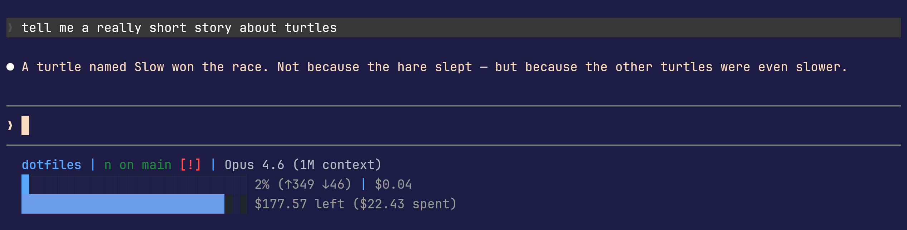

# dotfiles

Dev environment bootstrap for Ubuntu-compatible x64 distros (Ubuntu, Linux Mint, Pop!_OS, elementary OS, etc.). Managed by [chezmoi](https://www.chezmoi.io/).


## Highlights

- **Click-to-focus notifications** -- Claude Code tasks send desktop notifications that jump to the correct terminal window when clicked, and auto-dismiss when you're already looking at it

  

- **Smart VCS prompt** -- Starship shows jj change IDs with nearest ancestor bookmark, or git branch with short hash on detached HEAD. Modified status at a glance, no duplicate indicators in colocated repos
- **Per-project tab coloring** -- each Claude Code session gets a unique Kitty tab color so you can tell projects apart instantly
- **Rich status line** -- Claude Code status bar shows VCS state, context window usage with blue-to-red gradient, rate limit indicators, and monthly budget tracking. Adapted from [andrewburgess/dotfiles](https://github.com/andrewburgess/dotfiles)

  

## What's included

### Tools (managed by [mise](https://mise.jdx.dev/))

All developer tools are installed and kept up to date by [mise](https://mise.jdx.dev/), a polyglot runtime/tool version manager:

- **[Kitty](https://sw.kovidgoyal.net/kitty/)** terminal with Adventure Time theme, tiling layouts, and tuned performance
- **[Starship](https://starship.rs/)** prompt with [Jujutsu (jj)](https://jj-vcs.github.io/jj/) change/bookmark display, git fallback, k8s context, and language version indicators
- **[Neovim](https://neovim.io/)** with [kitty-scrollback.nvim](https://github.com/mikesmithgh/kitty-scrollback.nvim) for easy copy/paste from terminal scrollback
- **[Jujutsu (jj)](https://jj-vcs.github.io/jj/)** version control with [difftastic](https://difftastic.wilfred.me/) structural diffs
- **[GitHub CLI (gh)](https://cli.github.com/)** for PRs, issues, and API calls
- **[zoxide](https://github.com/ajr-f0/zoxide)** for fast directory jumping (`z`)
- **[Claude Code](https://docs.anthropic.com/en/docs/claude-code)** AI coding assistant
- **[Bun](https://bun.sh/)** JavaScript runtime (used by Claude Code status line)
- **[Go](https://go.dev/)**, **[Rust](https://www.rust-lang.org/)**, **[Python 3](https://www.python.org/)**, **[Node.js](https://nodejs.org/)** (LTS)
- **[jq](https://jqlang.github.io/jq/)** for JSON processing

### Configs

- **[JetBrainsMono Nerd Font](https://github.com/ryanoasis/nerd-fonts/tree/master/patched-fonts/JetBrainsMono)** for ligatures and icons
- **Claude Code** hooks and customizations:
  - `/jj` skill -- Jujutsu workflow reference loaded automatically during version control operations
  - Click-to-focus desktop notifications with response preview and auto-dismiss
  - Per-project Kitty tab coloring on session start
  - Status line with VCS info, context window gradient bar, rate limit dots, and monthly budget tracker

## Usage

### Fresh install

```bash
# Install chezmoi and apply dotfiles in one command
sh -c "$(curl -fsLS get.chezmoi.io)" -- init --apply tristanburgess/dotfiles
```

Or if you prefer to clone manually:

```bash
git clone git@github.com:tristanburgess/dotfiles.git
chezmoi init --source dotfiles/ --apply
```

On first run, chezmoi prompts for your name and email (used in jj/git config). After install:

```bash
source ~/.bashrc
gh auth login
claude  # authenticate Claude Code
```

Then open a new Kitty terminal.

### Updating configs

Edit files under `home/` using chezmoi naming conventions, then:

```bash
chezmoi apply    # deploy changes to ~
chezmoi diff     # preview what would change
```

Or edit deployed files directly and pull changes back:

```bash
chezmoi re-add   # update source from deployed files
```

## Structure

```
dotfiles/
├── .chezmoiroot              # points chezmoi to home/ as source root
├── home/                     # chezmoi source state
│   ├── .chezmoi.toml.tmpl    # chezmoi config (prompts for name/email)
│   ├── .chezmoiignore        # files chezmoi shouldn't manage
│   ├── .chezmoiscripts/      # setup scripts (packages, fonts, shell integrations)
│   ├── dot_config/           # → ~/.config/ (kitty, starship, jj, nvim)
│   ├── dot_claude/           # → ~/.claude/ (settings, hooks, skills)
│   └── bin/                  # → ~/bin/
├── assets/                   # README screenshots
└── README.md
```
