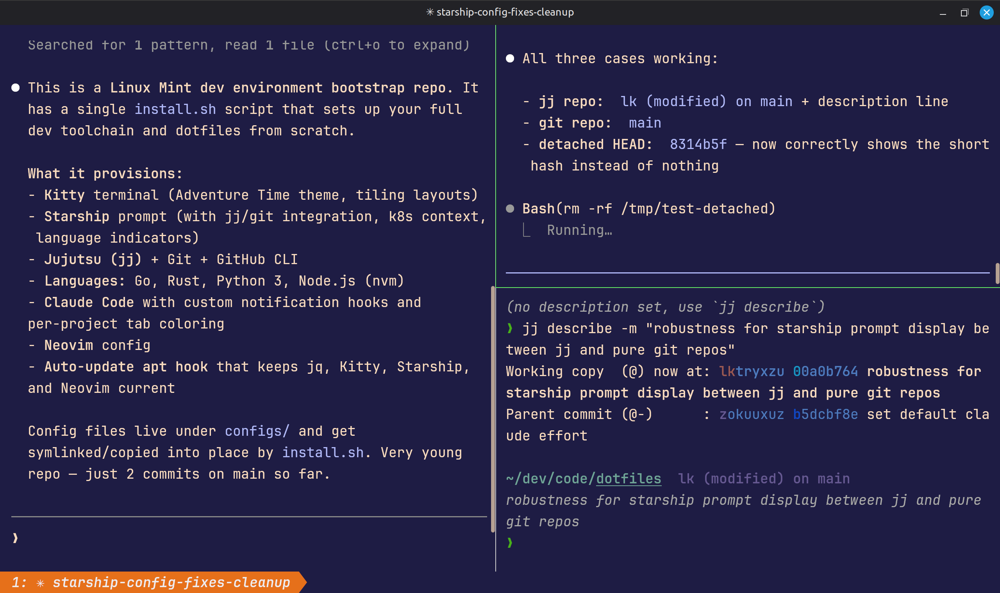
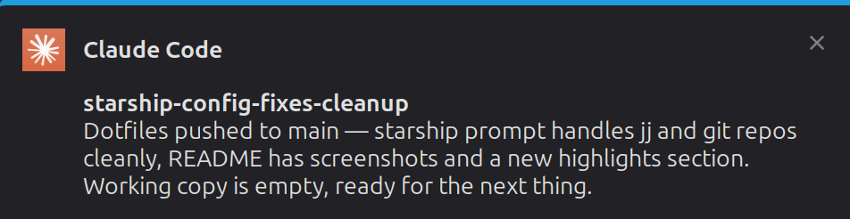

# dotfiles

Dev environment bootstrap for Ubuntu-compatible x64 distros (Ubuntu, Linux Mint, Pop!_OS, elementary OS, etc.). One script installs and configures everything.



## Highlights

- **Click-to-focus notifications** -- Claude Code tasks send desktop notifications that jump to the correct terminal window when clicked, and auto-dismiss when you're already looking at it

  

- **Smart VCS prompt** -- Starship shows jj change IDs with nearest ancestor bookmark, or git branch with short hash on detached HEAD. Modified status at a glance, no duplicate indicators in colocated repos
- **Per-project tab coloring** -- each Claude Code session gets a unique Kitty tab color so you can tell projects apart instantly
- **Rich status line** -- Claude Code status bar shows VCS state, context window usage with blue-to-red gradient, rate limit indicators, and monthly budget tracking

## What's included

### Tools (managed by [mise](https://mise.jdx.dev/))

All developer tools are installed and kept up to date by [mise](https://mise.jdx.dev/), a polyglot runtime/tool version manager:

- **[Kitty](https://sw.kovidgoyal.net/kitty/)** terminal with Adventure Time theme, tiling layouts, and tuned performance
- **[Starship](https://starship.rs/)** prompt with [Jujutsu (jj)](https://jj-vcs.github.io/jj/) change/bookmark display, git fallback, k8s context, and language version indicators
- **[Neovim](https://neovim.io/)** with [kitty-scrollback.nvim](https://github.com/mikesmithgh/kitty-scrollback.nvim) for easy copy/paste from terminal scrollback
- **[Jujutsu (jj)](https://jj-vcs.github.io/jj/)** version control with [difftastic](https://difftastic.wilfred.me/) structural diffs
- **[GitHub CLI (gh)](https://cli.github.com/)** for PRs, issues, and API calls
- **[zoxide](https://github.com/ajr-f0/zoxide)** for fast directory jumping (`z`)
- **[Claude Code](https://docs.anthropic.com/en/docs/claude-code)** AI coding assistant
- **[Go](https://go.dev/)**, **[Rust](https://www.rust-lang.org/)**, **[Python 3](https://www.python.org/)**, **[Node.js](https://nodejs.org/)** (LTS)
- **[jq](https://jqlang.github.io/jq/)** for JSON processing

### Configs

- **[JetBrainsMono Nerd Font](https://github.com/ryanoasis/nerd-fonts/tree/master/patched-fonts/JetBrainsMono)** for ligatures and icons
- **Claude Code** hooks and customizations:
  - `/jj` skill -- Jujutsu workflow reference loaded automatically during version control operations
  - Click-to-focus desktop notifications with response preview and auto-dismiss
  - Per-project Kitty tab coloring on session start
  - Status line with VCS info, context window gradient bar, rate limit dots, and monthly budget tracker

## Usage

```bash
git clone <this-repo> ~/dev/code/dotfiles
cd ~/dev/code/dotfiles
chmod +x install.sh
./install.sh
```

After install, complete the manual steps:

```bash
source ~/.bashrc
gh auth login
claude  # authenticate Claude Code
```

Then open a new Kitty terminal.

## Updating configs

Edit the files under `configs/`, then re-run `./install.sh` -- it will overwrite the deployed copies. Tool installations are skipped if already present.
